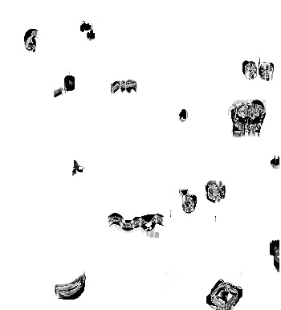
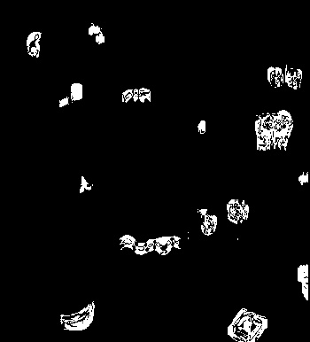

# Spot The Difference 
### A program to solve the Spot The Difference puzzles

## Libraries Required: 
    * Python 3.8.2
    * Numpy 1.18.3
    * Open CV 4.2.0
    * Imutils 0.5.3
    * Scikit-Image 0.16.2
## Dataset Required
A single image consisting of both original and modified pictures is required. The program splits the image itself.

## Working of the code
Run each cell in sequential order.  
1. The program takes an input as the single image
  

2. The input image is split by width and coverted to gray-scale
    First Image  | Modified Image
    ------------ | -------------
    |  

3. The structural similarity of both images are compared  
 

4. Compare and find threshholds   
       

5. Grab contours from the difference

6. Draw bounding recatngles in the original image across the contours identified  
    First Image  | Modified Image
    ------------ | -------------
    | 

## Output

2 images are written in the images folder with the bounding boxes where difference is identified.

